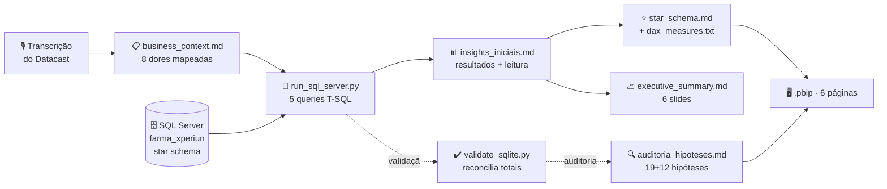

# Farma Xperiun · Do dado bruto à decisão de negócio

**Pipeline analítico ponta a ponta para uma farmácia de bairro com seis anos de operação e nenhuma resposta sobre si mesma.**

`SQL Server` · `T-SQL` · `Python` · `Power BI` · `DAX` · `Modelagem Dimensional`

[](https://www.linkedin.com/in/lucasdelfino-/)

---

## O problema

Toda farmácia vende. Poucas sabem o que vendem de verdade.

A Farma Xperiun operou seis anos, registrou **85.407 vendas** e acumulou **R$ 2,31 milhões de receita** — com um sistema de metas mensais, um catálogo de 33 medicamentos e oito fornecedores. E ainda assim a direção não sabia responder perguntas básicas do próprio negócio:

- Quais produtos sustentam o lucro, e quais só ocupam prateleira?
- O turno da noite vende mais ou menos que o da manhã?
- A meta foi batida — ou o mês fechou no vermelho?
- Por que outubro é sempre forte?
- O que aconteceu no fim de 2019, quando as metas zeraram?

Este projeto responde as cinco. **Quatro das respostas contrariam o que a direção acreditava.**

---

## O diferencial deste projeto

A maior parte dos trabalhos de análise confirma o que o cliente já suspeitava. Este não confirma.

| Hipótese de partida | Veredito | O que os dados mostraram |
|---|---|---|
| Seis anos de crescimento implacável | ❌ **Refutada** | Nenhum ano com meta batida. E a meta seguia o resultado, não o contrário |
| O negócio encerrou no fim de 2019 | ❌ **Refutada** | Receita por dia saudável até o último registro — parou a captura, não a operação |
| A noite é o turno mais fraco | ❌ **Refutada** | Lidera em receita, lucro e fluxo por hora de operação |
| A Neo Química é o gargalo logístico | ✅ **Confirmada** | E dimensionada em reais — mas a concentração na Medley é o risco maior |
| Outubro é alergia de primavera ou Outubro Rosa | ❌ **Ambas refutadas** | Os antialérgicos *caem* em outubro. O motor são analgésicos e antiasmáticos |

Cada query do projeto carrega, no próprio código, a **hipótese registrada antes de olhar o resultado**:

```sql
-- RACIONAL: [a dor da diretoria que originou esta consulta]
-- OBJETIVO: [a pergunta exata de negócio]
-- INSIGHT ESPERADO: [a hipótese, escrita antes de rodar]
```

Escrever a hipótese antes é o que separa análise de justificativa. Sem esse registro, qualquer resultado vira confirmação retroativa de alguma coisa.

Essa mesma disciplina foi aplicada de novo, numa segunda rodada: as **19 hipóteses levantadas
de viva voz pela diretoria** no áudio do Datacast e as **12 hipóteses próprias** levantadas
sem roteiro foram auditadas uma a uma contra o banco — ver [Fase 3](#fase-3--auditoria-das-hipóteses-do-datacast-e-cenários-ocultos).

---

## Arquitetura



O fluxo tem uma regra: **nada avança sem a etapa anterior.** Nenhuma query foi escrita antes do mapeamento das dores. Nenhuma medida DAX foi escrita antes de existir um resultado que a justificasse. Nenhum slide foi montado antes do número estar validado.

---

## Estrutura

```
.
├── docs/
│   ├── business_context.md          Fase 1 · as 8 dores extraídas do áudio da diretoria
│   ├── insights_iniciais.md         Fase 2 · 5 queries, resultados reais e leitura analítica
│   ├── cenarios_ocultos.md          Fase 2.5 · 3 achados novos, sem roteiro, pré-Power BI
│   ├── auditoria_hipoteses.md       Fase 3 · 19+12 hipóteses auditadas + 8 recomendações
│   └── meta_vs_realizado_ruido.md   Nota lateral · a lógica estatística por trás da meta
├── scripts/
│   ├── run_sql_server.py            Entregável oficial · T-SQL via pyodbc + Windows Auth
│   └── validate_sqlite.py           Harness de validação · reconcilia contra o gabarito
├── powerbi/
│   ├── PharmaVantage Analytics.pbip         Projeto Power BI (PBIP)
│   ├── PharmaVantage Analytics.Report/      6 páginas, definição em PBIR
│   ├── PharmaVantage Analytics.SemanticModel/   Modelo tabular, TMDL, 50+ medidas DAX
│   ├── star_schema.md               Modelo dimensional, cardinalidades e direções de filtro
│   ├── dax_measures.txt             Medidas em 8 pastas, VAR em todo cálculo composto
│   └── mockup_dashboard.html        Mockup navegável, precursor do .pbip
├── presentation/
│   └── executive_summary.md         Roteiro de 6 slides, sem jargão técnico
├── CHANGELOG.md                     Histórico de versões do projeto
└── README.md
```

🖥️ **Relatório completo (6 páginas, `.pbip`):** ver `powerbi/`
🔍 **Auditoria das hipóteses (HTML):** [Farma Xperiun sob Auditoria](https://claude.ai/code/artifact/3c747f2d-8622-4694-bf4e-c47c5257a889)
🗺️ **Cenários ocultos (HTML):** [Cenários Ocultos](https://claude.ai/code/artifact/9f0a39b6-b30f-4b78-bc6a-38218ffa4670)
🖼️ **Mockup original (3 telas):** [3 telas do dashboard](https://claude.ai/code/artifact/0762d509-2d8f-43f4-9d2a-d567d401b5e2)

---

## Stack — e por que cada peça

| Camada | Ferramenta | Por quê |
|---|---|---|
| **Origem** | SQL Server local | Modelo estrela já normalizado. A conversão de `data` para `DATE` é resolvida **na origem** — corrige o problema uma vez para todos os consumidores, em vez de repetir a correção em cada relatório |
| **Exploração** | Python + pyodbc | Query e narrativa versionadas no mesmo arquivo. Reexecutar o script reproduz o documento inteiro — resultado *e* interpretação |
| **Validação** | SQLite + reconciliação automática | Antes de rodar em produção, a mesma álgebra roda contra a base oficial e é conferida contra os totais publicados. Se não bater, o erro está na query, não no banco |
| **Modelagem** | Power BI · esquema estrela | Seis relações 1:N com filtro simples. Nenhuma bidirecional, nenhuma ambiguidade de caminho |
| **Cálculo** | DAX com `VAR` | Legibilidade e uma única avaliação por variável. Cada medida documenta a dor que endereça |
| **Comunicação** | Mockup HTML antes do `.pbix` | Validar layout com a diretoria custa uma tarde. Refazer o relatório depois de pronto custa uma semana |

---

## Decisões de engenharia que valeram o projeto

### 1. `d_meta_mensal` não é uma dimensão

A documentação da base chama de dimensão e avisa que "não existe FK com o fato". A busca por essa chave é infrutífera por um motivo simples: **a tabela contém medidas aditivas e descreve um evento de planejamento. É um fato de orçamento em grão mensal.**

O problema real não é chave, é granularidade — o fato é diário, a meta é mensal. A solução é uma **dimensão conformada**, `d_periodo`, com relação 1:N para o calendário e para a meta:

```
d_periodo ──1:N──> d_calendario ──1:N──> f_vendas   (realizado)
    └─────1:N──> f_meta_mensal                       (planejado)
```

E a propriedade mais valiosa dessa escolha: **ao filtrar por dia, a meta não responde.** Está correto — não existe meta diária. A medida retorna vazio em vez de exibir um percentual inventado. A alternativa comum (ratear a meta pelos dias do mês) produziria um número que *parece* dado, exibido com a mesma autoridade visual de um número real.

Um modelo bem construído se recusa a responder o que os dados não podem responder.

### 2. O denominador honesto

Outubro de 2019 tem 8 dias de venda. Em valor absoluto parece colapso; em **receita por dia operado** está acima de junho, julho, agosto e setembro do mesmo ano.

`DISTINCTCOUNT(f_vendas[data])` como denominador é uma linha de DAX. É também a diferença entre concluir que a farmácia morreu e concluir que o sistema parou de registrar.

### 3. Normalizar antes de comparar

O turno da noite tem 4 horas; manhã e tarde têm 5. Comparar faturamento absoluto entre eles penaliza a noite por construção — e foi essa comparação que sustentou a decisão de encurtar justamente o turno mais rentável.

### 4. Reconciliação como teste unitário

`validate_sqlite.py` confere os totais contra o gabarito publicado na documentação da base antes de gerar qualquer documento:

```
[OK] transacoes       esperado=     85,407.00   obtido=     85,407.00
[OK] receita_total    esperado=  2,313,807.90   obtido=  2,313,807.90
[OK] lucro_total      esperado=    671,861.32   obtido=    671,861.32
[OK] ticket_medio     esperado=         27.09   obtido=         27.09
```

Uma query pode estar sintaticamente perfeita e semanticamente errada — um `JOIN` que duplica linhas passa despercebido até alguém somar. Reconciliar contra um total conhecido pega isso na hora. A mesma disciplina foi repetida na Fase 3: cada número do relatório de auditoria foi recalculado por um agente independente, direto no banco, sem confiar no texto já escrito — pegou 2 imprecisões antes da entrega (ver `docs/auditoria_hipoteses.md`, seção "Auditoria dos números").

### 5. Limitação exposta é limitação tratada

Nesta base os antialérgicos têm **pico no inverno** e os antiasmáticos **caem no inverno** — o inverso da expectativa clínica e da própria orientação da documentação do desafio.

Isso podia ter virado uma nota de rodapé. Virou um alerta em tarja âmbar no meio da tela de diagnóstico e um item com prazo no plano de ação. Uma limitação escondida vira decisão errada; exposta, vira pergunta para o negócio.

---

## Fase 3 — Auditoria das hipóteses do Datacast e cenários ocultos

A diretoria registrou 19 hipóteses de viva voz no áudio do Datacast (crescimento
implacável, geografia dos fornecedores, o "mistério" de 2019, sazonalidade de outubro,
entre outras). Cada uma foi auditada contra o banco, com veredito de **Confirmada /
Refutada / Parcial / Não verificável** — nenhuma aceita por autoridade de quem falou.

Em paralelo, uma segunda rodada sem roteiro (`docs/cenarios_ocultos.md`) testou mais 14
hipóteses próprias e chegou ao achado mais relevante do projeto: **67% da queda de margem
de 2014 a 2019 vem de mudança no mix de produtos** (migração para categorias controladas,
que têm margem estruturalmente menor por regulação de preço) — não de erosão de
preço/custo nem de desconto agressivo, como a intuição sugeriria.

Isso virou entrega formal em duas frentes:

- **`docs/auditoria_hipoteses.md`** — as 19 hipóteses do Datacast + 12 hipóteses próprias
  (7 confirmadas, 5 refutadas) + respostas às perguntas do briefing (`Solicitação.txt`) +
  ranking de impacto + 8 recomendações aplicáveis.
- **Duas páginas novas no `.pbip`:** *04 · Hipóteses do Datacast* (veredito visual das
  hipóteses com maior carga de dado) e *05 · Cenários & Impacto* (o efeito-mix de margem,
  lucro perdido por produto abaixo da média da casa, e o gap de margem da Cimed vs.
  benchmark), sustentadas por 4 medidas DAX novas (`% da Receita Total`, `Margem Média da
  Casa`, `Lucro Perdido vs. Média da Casa`, `Lucro Perdido Total (produtos)`).

Uma investigação lateral adicional — por que a meta mensal nunca acompanha o realizado —
está registrada em `docs/meta_vs_realizado_ruido.md`: o padrão estatístico (meta ≈
realizado do mesmo mês × ruído aleatório, sem viés por mês ou por ano) explica por que
~97% de atingimento agregado convive com só 45% dos meses individualmente batidos.

---

## Como reproduzir

```bash
pip install pyodbc

# Contra o SQL Server local (Windows Authentication)
python scripts/run_sql_server.py

# Instância nomeada
python scripts/run_sql_server.py --server "localhost\SQLEXPRESS"

# Validar a lógica sem SQL Server, contra a base SQLite do desafio
python scripts/validate_sqlite.py
```

Ambos geram `docs/insights_iniciais.md`. O script detecta o driver ODBC disponível automaticamente e normaliza os tipos de data nas CTEs — funciona com `f_vendas.data` como `DATE` ou como texto.

**Gabarito do modelo em Power BI.** Sem filtros, o relatório deve reproduzir:

| Indicador | Valor |
|---|---|
| Transações | 85.407 |
| Receita líquida | R$ 2.313.807,90 |
| Lucro | R$ 671.861,32 |
| Ticket médio | R$ 27,09 |
| Dias operados | 2.080 |
| Meses com meta batida | 31 de 69 |

Se qualquer um desses seis divergir, o erro está no modelo — não no banco.

---

## Como o modelo resolve as dores do varejo farmacêutico

O varejo farmacêutico tem quatro tensões estruturais. O modelo endereça as quatro:

**Giro contra margem.** Medicamento controlado tem margem menor por regulação de preço. Nesta farmácia, o Sistema Respiratório lidera a receita (R$ 717 mil) com a pior margem (23,9%), enquanto os Analgésicos faturam R$ 24 mil a menos e geram **R$ 98 mil de lucro a mais**. A medida `Quadrante Volume × Margem` separa âncora de lucro de gerador de tráfego — perguntas diferentes que a gestão tratava como uma só.

**Capital preso em estoque.** Prazo de entrega vira estoque de segurança, e estoque de segurança vira capital parado. `Capital Imobilizado em Estoque` põe reais nessa frase, por fornecedor. Resultado: dois fornecedores com fatia de receita idêntica, um travando três vezes mais capital que o outro.

**Sazonalidade que ninguém mede.** Estoque de sazonal comprado errado é dinheiro parado ou venda perdida — não existe meio-termo. O índice sazonal **por categoria**, e não pelo total, foi o que permitiu testar as duas teses de outubro em vez de escolher uma por intuição.

**Meta que não organiza esforço.** Metas mensais planas ignoram que os meses têm quantidades diferentes de dias úteis e feriados. `Meta Ajustada por Dias Úteis` separa o que é desempenho do que é artefato de calendário — e `Aderência da Meta ao Realizado` denuncia quando a meta virou espelho do passado. A Fase 3 aprofundou essa pista até a causa estatística provável (`docs/meta_vs_realizado_ruido.md`).

---

## Limitações declaradas

- **Feriados móveis** (Carnaval, Sexta-Feira Santa, Corpus Christi) não constam de `d_calendario`. Quedas nessas datas aparecem como dia comum e não devem ser lidas como comportamento do consumidor.
- **2019 é ano parcial** (termina em 08/10) e foi excluído do cálculo de índices sazonais, para não distorcer o mês em teste.
- **Metas de out/nov/dez de 2019 estão zeradas** por característica da base. Meta zero é ausência de meta, não meta baixa — os três meses saem do cálculo de atingimento.
- **A sazonalidade invertida** de antialérgicos e antiasmáticos é reportada como achado a validar, nunca como recomendação de compra.
- **O que interrompeu o registro em outubro de 2019** não é respondível pelos dados. A análise mostra que a operação estava saudável no último dia; a causa da interrupção está fora da base.
- **Os materiais brutos do desafio** (áudio do Datacast, planilha original, banco SQLite, transcrição, dúvidas da diretoria) não fazem parte deste repositório — são insumo do curso, não produto do trabalho. Toda análise derivada deles está documentada em `docs/`.

---

**Autor:** Lucas Delfino — [linkedin.com/in/lucasdelfino-](https://www.linkedin.com/in/lucasdelfino-/)

*Data Challenge · MBA em Data Analytics · Xperiun*
