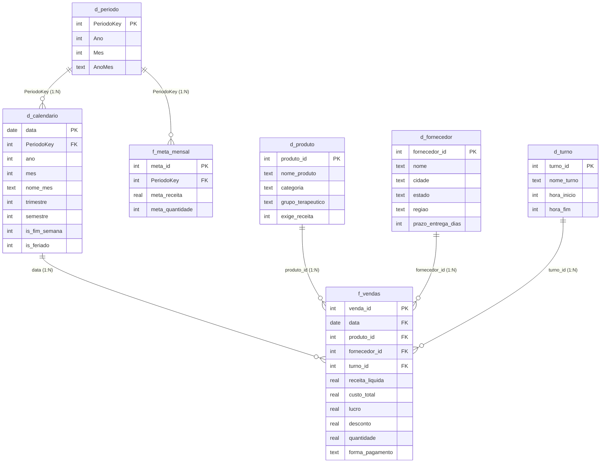

# Arquitetura do Modelo Dimensional — Farma Xperiun
### Fase 3 · Power BI · Padrão PL-300

| | |
|---|---|
| **Modelo** | Star schema (Kimball) · 1 fato transacional + 1 fato de orçamento + 6 dimensões |
| **Storage mode** | Import (base de 85.407 linhas — não justifica DirectQuery) |
| **Granularidade do fato** | 1 linha = 1 item de venda |
| **Período** | 02/01/2014 a 08/10/2019 |
| **Ancoragem analítica** | `docs/business_context.md` · `docs/insights_iniciais.md` |

---

## 1. Diagrama do modelo



---

## 2. Relacionamentos — especificação completa

| # | Tabela origem (1) | Coluna | Tabela destino (N) | Coluna | Cardinalidade | Direção do filtro | Ativo |
|---|---|---|---|---|---|---|---|
| R1 | `d_calendario` | `data` | `f_vendas` | `data` | 1:N (Um para muitos) | **Simples** → | ✔ |
| R2 | `d_produto` | `produto_id` | `f_vendas` | `produto_id` | 1:N | **Simples** → | ✔ |
| R3 | `d_fornecedor` | `fornecedor_id` | `f_vendas` | `fornecedor_id` | 1:N | **Simples** → | ✔ |
| R4 | `d_turno` | `turno_id` | `f_vendas` | `turno_id` | 1:N | **Simples** → | ✔ |
| R5 | `d_periodo` | `PeriodoKey` | `d_calendario` | `PeriodoKey` | 1:N | **Simples** → | ✔ |
| R6 | `d_periodo` | `PeriodoKey` | `f_meta_mensal` | `PeriodoKey` | 1:N | **Simples** → | ✔ |

**Nenhum relacionamento bidirecional. Nenhum relacionamento inativo. Nenhuma ambiguidade de caminho.**

---

## 3. O problema da meta — e por que a solução é uma dimensão de período

### O problema

A documentação do desafio é explícita: *"A tabela d_meta_mensal não possui FK direta com f_vendas. O relacionamento é lógico, via ano e mês. No Power BI, você precisará decidir como modelar essa conexão."*

A dificuldade real é de **granularidade**, não de chave. `f_vendas` é diária; `d_meta_mensal` é mensal. Não existe relação 1:N possível entre `d_calendario` (2.191 linhas de dia) e uma tabela de 72 linhas de mês — a coluna `ano`+`mes` do calendário não é única, e o Power BI exige unicidade do lado "1".

E há um erro de nomenclatura embutido no material: **`d_meta_mensal` não é uma dimensão.** Ela contém medidas aditivas (`meta_receita`, `meta_quantidade`) e descreve um evento de planejamento. É um **fato de orçamento** em grão mensal. Chamá-la de dimensão foi o que levou à busca por uma FK que nunca poderia existir.

### As três soluções possíveis

| Abordagem | Como funciona | Veredito |
|---|---|---|
| **A. Dimensão de período conformada** | Cria-se `d_periodo` (72 linhas, uma por mês) com relação 1:N para `d_calendario` **e** para `f_meta_mensal` | ✅ **Adotada** |
| **B. `TREATAS` em DAX** | Sem relacionamento físico; o filtro é transferido em tempo de consulta | ⚠️ Plano B |
| **C. Alocar a meta por dia** | Dividir a meta mensal pelos dias do mês e materializar no calendário | ❌ Rejeitada |

### Por que a Abordagem A

`d_periodo` é uma **dimensão conformada** — o conceito clássico de Kimball para conectar dois fatos de granularidades diferentes. Ela fica acima do calendário na hierarquia e filtra os dois lados a partir de um único ponto:

```
d_periodo ──1:N──> d_calendario ──1:N──> f_vendas      (realizado)
    └─────1:N──> f_meta_mensal                          (planejado)
```

Ao filtrar `d_periodo[AnoMes] = "2019-01"`, ambos os fatos respondem, e `[% Atingimento Meta]` funciona nativamente, sem DAX defensivo.

**A propriedade mais importante desta escolha:** se o usuário filtrar por um **dia** em `d_calendario`, a meta **não** é filtrada — e isso está correto. Não existe meta diária. A alternativa C produziria um número que parece uma meta diária e não é: seria uma invenção do modelo, exibida com a mesma autoridade visual de um dado real. **Um modelo bem construído se recusa a responder perguntas que os dados não podem responder.**

Como salvaguarda, a medida `[% Atingimento Meta]` retorna vazio quando o contexto é mais granular que o mês — em vez de exibir um percentual absurdo.

### Construção de `d_periodo` (Power Query — M)

```m
let
    Fonte = Table.Distinct(
        Table.SelectColumns(f_meta_mensal, {"ano", "mes"})
    ),
    ChaveAdicionada = Table.AddColumn(Fonte, "PeriodoKey",
        each [ano] * 100 + [mes], Int64.Type),
    AnoMesAdicionado = Table.AddColumn(ChaveAdicionada, "AnoMes",
        each Text.From([ano]) & "-" & Text.PadStart(Text.From([mes]), 2, "0"), type text),
    Ordenado = Table.Sort(AnoMesAdicionado, {{"PeriodoKey", Order.Ascending}})
in
    Ordenado
```

A mesma coluna `PeriodoKey = ano * 100 + mes` é criada em `d_calendario` e em `f_meta_mensal`.

> **Nota de qualidade:** `d_periodo` derivada de `f_meta_mensal` cobre 2014–2019 completos (72 meses), incluindo nov e dez/2019 — meses com meta zero e sem venda. Isso é deliberado: a dimensão precisa conter o período inteiro para que a ausência de resultado seja visível como ausência, e não como linha faltante.

> **Nota de implementação:** esta construção via Power Query não é só estilo — é necessária. Uma primeira versão implementou `d_periodo` como tabela **calculada em DAX** (`SUMMARIZE`/`ADDCOLUMNS`), e o Power BI Desktop passou a falhar ao reabrir o `.pbip` com `Relationship ... uses an invalid column ID`. É uma limitação conhecida do motor TOM: relações que apontam para a coluna de uma tabela calculada por `SUMMARIZE`/`DISTINCT` podem ser criadas via API, mas falham ao recriar o banco do zero (o que o Power BI Desktop faz toda vez que abre um `.pbip`) — ver github.com/TabularEditor/TabularEditor/issues/891. A tabela Power Query descrita acima não tem esse problema porque nenhuma coluna envolvida na relação é calculada.

---

## 4. Por que nenhum relacionamento é bidirecional

O filtro cruzado bidirecional é o atalho mais comum e mais caro em modelos de Power BI. Ele foi evitado por quatro razões:

1. **Ambiguidade de caminho.** Com R1 e R5 bidirecionais, `d_periodo` alcançaria `f_vendas` por dois caminhos. O motor escolhe um — nem sempre o que o analista imaginou — e o resultado passa a depender de detalhe interno de engine.
2. **Performance.** Propagação bidirecional força varredura adicional a cada consulta. Em 85 mil linhas o custo é imperceptível; o hábito, aplicado a um modelo de milhões, não é.
3. **Segurança.** RLS aplicado a uma dimensão vaza por relacionamentos bidirecionais de forma difícil de auditar. Mesmo sem RLS hoje, o modelo não deve criar essa dívida.
4. **É desnecessário.** Todo requisito das Fases 1 e 2 é atendido com filtro simples. Quando um caso pontual exigir propagação reversa, o lugar certo é `CROSSFILTER()` dentro da medida específica — explícito, localizado e auditável — não uma propriedade global do modelo.

---

## 5. Configuração das tabelas

### 5.1 `d_calendario` — Tabela de Datas

**Marcar como Tabela de Datas** (`Modelagem → Marcar como tabela de data → data`). Sem isso, `SAMEPERIODLASTYEAR`, `DATEADD` e `TOTALYTD` retornam resultados incorretos em contextos filtrados.

| Coluna | Tipo | Configuração |
|---|---|---|
| `data` | Date | PK · Ocultar da exibição de relatório? **Não** |
| `PeriodoKey` | Whole Number | FK · **Ocultar** · Summarization: None |
| `ano` | Whole Number | Summarization: **None** |
| `mes` | Whole Number | **Ocultar** (usada só como coluna de ordenação) |
| `nome_mes` | Text | **Sort by column → `mes`** |
| `nome_dia_semana` | Text | **Sort by column → `dia_semana`** |
| `is_fim_semana` | Whole Number | Substituir por coluna calculada `Tipo de Dia` (texto) |
| `is_feriado` | Whole Number | idem |

**Coluna calculada recomendada** — resolve a DOR 6 em um único campo legível:

```dax
Tipo de Dia =
SWITCH(
    TRUE(),
    d_calendario[is_feriado] = 1,     "Feriado",
    d_calendario[is_fim_semana] = 1,  "Fim de Semana",
    "Dia Útil"
)
```

**Hierarquia `Calendário`:** `ano` → `semestre` → `trimestre` → `nome_mes` → `data`

> ⚠️ **Limitação a documentar no relatório:** feriados móveis (Carnaval, Sexta-Feira Santa, Corpus Christi) não constam da base. Quedas de receita nessas datas aparecerão classificadas como "Dia Útil". A limitação deve estar visível na página de documentação do dashboard, não escondida no modelo.

### 5.2 `d_produto`

**Hierarquia `Produto`:** `grupo_terapeutico` → `categoria` → `nome_produto`

```dax
Tipo de Venda =
IF(d_produto[exige_receita] = 1, "Controlado", "Venda Livre")
```

`preco_unitario`, `custo_unitario` e `margem_percentual` de `d_produto` são **preço de tabela** e devem ser **ocultados da exibição de relatório**. O preço praticado varia ±5% e está em `f_vendas`. Deixar as duas versões visíveis é convite a dois números diferentes para a mesma pergunta.

### 5.3 `d_fornecedor`

**Hierarquia `Geografia`:** `regiao` → `estado` → `cidade` → `nome`

`estado` → Categoria de dados: **State or Province**; `cidade` → **City**. Necessário para o visual de mapa da tela Diagnóstica.

`prazo_entrega_dias` → Summarization: **None** (é atributo, não medida; somar prazos não significa nada).

### 5.4 `d_turno`

`hora_inicio` e `hora_fim` → Summarization: **None**.

```dax
Duração do Turno (h) = d_turno[hora_fim] - d_turno[hora_inicio]
```

Esta coluna é o coração das medidas normalizadas por hora — a correção do viés de comparação identificado na Q3.

### 5.5 `f_vendas`

Todas as FKs (`produto_id`, `fornecedor_id`, `turno_id`, `PeriodoKey`) → **ocultas**. Colunas numéricas de fato → Summarization: **None**, para forçar o uso de medidas explícitas em vez de agregações implícitas.

`data` deve estar como **Date**. O script `Alteração da coluna data - de text para date.sql` já faz a conversão na origem — preferível a resolver no Power Query, porque corrige o problema uma vez para todos os consumidores do banco.

### 5.6 `f_meta_mensal`

Renomeada de `d_meta_mensal` para refletir sua natureza de fato de orçamento. `ano` e `mes` → **ocultos** (substituídos por `PeriodoKey`).

### 5.7 Tabelas auxiliares

| Tabela | Função | Relacionamento |
|---|---|---|
| `_Medidas` | Tabela vazia que hospeda todas as medidas DAX | Nenhum (desconectada) |
| `Cenário Hora Extra` | Parâmetro What-If (0 a 3 horas, passo 1) | Nenhum (desconectada) |

`Cenário Hora Extra` transforma o achado da Q3 — a noite é o turno mais produtivo por hora — em simulação interativa na tela Comparativa, permitindo à diretoria dimensionar a extensão do turno antes de decidir.

---

## 6. Checklist de validação do modelo

- [ ] `d_calendario` marcada como Tabela de Datas
- [ ] `d_calendario` cobre o ano inteiro (01/01/2014 a 31/12/2019), sem lacunas
- [ ] Todas as 6 relações são 1:N com filtro **Simples**
- [ ] Nenhum relacionamento bidirecional ou inativo
- [ ] Nenhuma relação Muitos-para-Muitos
- [ ] Todas as FKs ocultas da exibição de relatório
- [ ] `nome_mes` e `nome_dia_semana` com Sort by column configurado
- [ ] Summarization = None em todos os IDs e atributos numéricos
- [ ] Preço/custo de `d_produto` ocultos (fonte única = `f_vendas`)
- [ ] 3 hierarquias criadas (Calendário, Produto, Geografia)
- [ ] Medidas em `_Medidas`, organizadas em display folders
- [ ] Format strings definidos em todas as medidas
- [ ] Modelo valida contra o gabarito: **85.407 transações · R$ 2.313.807,90 · R$ 671.861,32 · ticket R$ 27,09**

---

## 7. Do modelo às dores

| Dor (Fase 1) | Elemento do modelo que a resolve |
|---|---|
| 1 · Turno é um mistério | `d_turno[Duração do Turno (h)]` + medidas por hora |
| 2 · Malabarismo de compras | `d_fornecedor[prazo_entrega_dias]` × `f_vendas[custo_total]` |
| 3 · Sazonalidade não medida | Hierarquia Calendário + hierarquia Produto |
| 4 · Meta ≠ Realizado | `d_periodo` como dimensão conformada |
| 5 · Mistério de 2019 | `DISTINCTCOUNT(f_vendas[data])` como denominador honesto |
| 6 · Feriado / fim de semana | `d_calendario[Tipo de Dia]` |
| 7 · Pagamento × desconto | `f_vendas[forma_pagamento]` + `f_vendas[desconto]` |
| 8 · Volume × margem | `d_produto[Tipo de Venda]` + hierarquia Produto |

**Toda dimensão do modelo existe porque uma dor a exige. Nenhuma tabela foi incluída por estar disponível.**
